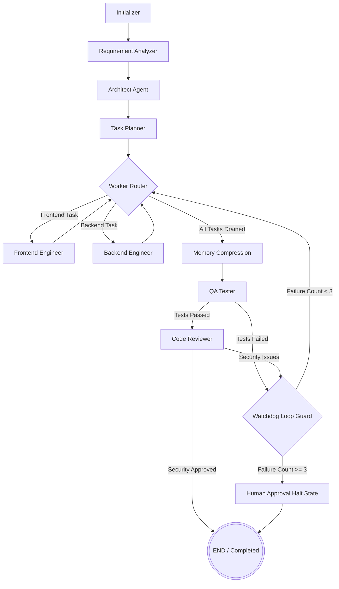

# 🏛 Architecture & State Management

This document details the architectural decisions, state management patterns, and edge routing logic powering our autonomous AI software engineering team.

---

## 🧠 LangGraph State Machine Architecture

The system is engineered as a deterministic **StateGraph** using LangGraph. The pipeline is fundamentally a finite state machine that transitions through discrete phases: `planning`, `development`, `testing`, `review`, and `completed` (or `blocked`).

Each node in the graph represents an isolated worker (or agent) that reads from a frozen snapshot of `ProjectState`, performs its deterministic LLM invocation or sandboxed side-effect, and returns an atomic state mutation dictionary.



---

## 💾 State Management & Reducer Registry

Our state is strictly typed using Python's `TypedDict` and augmented with custom mathematical reducers to enable conflict-free parallel branching, artifact deduplication, and atomic history truncations.

The single source of truth is `ProjectState` (defined in [`src/core/state.py`](src/core/state.py)):

```python
class ProjectState(TypedDict, total=False):
    project_id: str
    workspace_dir: str
    requirements: str
    technical_specifications: dict[str, Any]
    architecture_decisions: Annotated[list[dict[str, Any]], adr_reducer]
    project_structure: dict[str, Any]
    task_queue: Annotated[list[dict[str, Any]], task_queue_reducer]
    completed_tasks: Annotated[list[dict[str, Any]], clearable_list_reducer]
    code_artifacts: Annotated[list[dict[str, Any]], artifact_reducer]
    execution_trace: Annotated[list[dict[str, Any]], clearable_list_reducer]
    error_log: Annotated[list[dict[str, Any]], operator.add]
    retry_counts: Annotated[dict[str, int], dict_merge_reducer]
    task_failures: Annotated[dict[str, int], dict_merge_reducer]
    max_retries: int
    current_phase: str
    status: str
```

### Specialized Reducers ([`src/core/reducers.py`](src/core/reducers.py))

1. **`artifact_reducer`**:
   - Deduplicates artifacts by canonical normalized file path (`posixpath.normpath`).
   - Automatically bumps `version` upon content modifications.
   - Resets `tests_passed` to `None` when underlying source code is updated.
2. **`task_queue_reducer`**:
   - Performs atomic upserts by `task_id`.
   - Preserves FIFO execution order and dependency relations.
3. **`clearable_list_reducer`**:
   - Standard append-only reducer for telemetry and trace logs.
   - Clears the array when receiving `ClearSignal` or `"CLEAR"` sentinel without losing subsequent events.
4. **`dict_merge_reducer`**:
   - Conflict-free dictionary key-value updates for `retry_counts` and `task_failures`.
5. **`adr_reducer`**:
   - Deduplicates Architectural Decision Records by `decision_id`.

---

## 🔒 Checkpointing & Persistence Architecture

Located in [`src/core/checkpointer.py`](src/core/checkpointer.py), the checkpointer layer provides multi-backend persistence:

- **`MemorySaver`**: Fast, thread-isolated in-memory persistence for testing and local development.
- **`PostgresSaver`**: Enterprise relational checkpointing with connection pooling and audit logging.
- **`RedisSaver`**: Ultra-low-latency distributed checkpointing and pub/sub streaming.
- **`get_checkpointer()` Factory**: Automatically detects environment variables (`CHECKPOINTER_BACKEND`, `DATABASE_URL`, `REDIS_URL`) and gracefully falls back to memory if external systems are unreachable.

---

## 🔀 Dynamic Edge Routing Functions

Located in [`src/core/graph.py`](src/core/graph.py):

1. **`route_to_workers`**:
   - Evaluates `task_queue`.
   - If tasks with `status != "completed"` exist, inspects the next task's file path (`.tsx`, `.jsx`, `.css`, `frontend/` $\rightarrow$ `frontend_engineer`; otherwise $\rightarrow$ `backend_engineer`).
   - If all tasks are completed, routes to `memory_compression`.
2. **`route_after_tester`**:
   - Evaluates test outcomes. If fixing tasks were queued, routes to `watchdog`. If all tests passed, advances to `reviewer`.
3. **`route_after_reviewer`**:
   - Evaluates static code review findings. If issues were flagged, routes to `watchdog`. If approved, transitions to `END`.
4. **`route_after_watchdog`**:
   - Inspects `task_failures` and `retry_counts`.
   - If any task has failed $\ge 3$ times, triggers an emergency halt to `human_approval`.
   - Otherwise, routes back to `route_to_workers` for automated retry.

---

## 🛡 Fault Tolerance & Retry Middleware

Instead of scattering ad-hoc `try/except` loops across agents, every node is decorated with `@retry_middleware(max_retries=3)` ([`src/core/middleware.py`](src/core/middleware.py)):
- Intercepts uncaught exceptions and API timeouts.
- Records structured `ErrorRecord` objects in `error_log`.
- Tracks attempt counters in `retry_counts[node_name]`.
- Implements deterministic exponential backoff ($1\text{s}, 2\text{s}, 4\text{s}$).
- Upon exhausting retries, cleanly marks the graph status as `failed` without crashing the host process.
