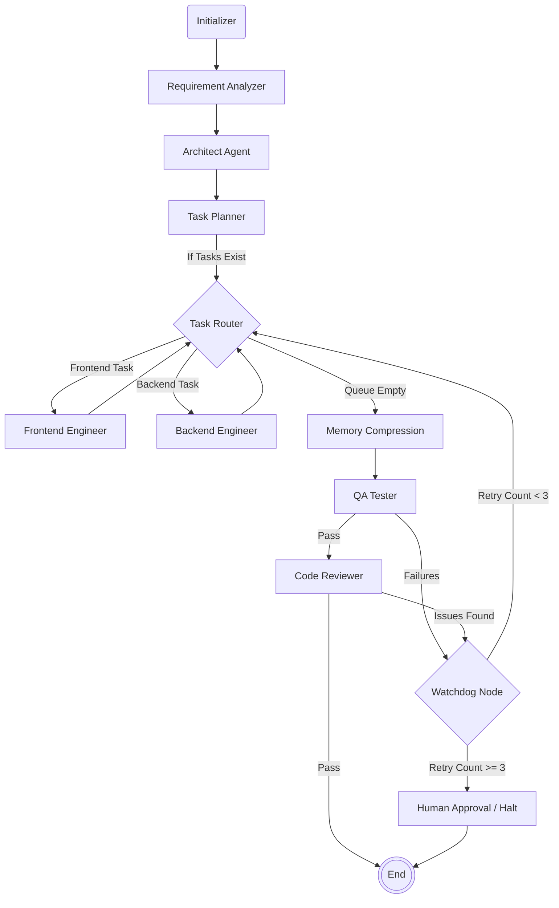

# Autonomous AI Software Engineering Team

A production-grade, multi-agent AI system built on LangGraph that plans, codes, tests, and reviews software autonomously in a sandboxed environment.

This project implements a sophisticated orchestration pipeline where specialised AI agents collaborate to break down natural language requirements into architectural designs, write backend and frontend code, run tests, review code for security flaws, and gracefully manage their own token memory.

## 🏛 The "Builder-as-Architect" Philosophy

At the core of this system is the **Builder-as-Architect** philosophy. Rather than having a single massive LLM context try to generate an entire application at once, the system delegates responsibilities strictly:
1. **Design First:** The Architect designs the entire project structure and APIs upfront. No code is written until the architecture is agreed upon.
2. **Atomic Execution:** The Task Planner decomposes the architecture into tiny, atomic tasks.
3. **Specialized Workers:** Frontend and Backend engineers execute single tasks from a queue with bounded autonomy.
4. **Validation Pipeline:** Every artifact is subjected to deterministic tests and static analysis before being accepted.

This philosophy guarantees high-quality, reproducible outputs, avoiding the "infinite loop" and "hallucination cascade" problems common in agentic systems.

## ⚙️ Core Tech Stack

- **Orchestration:** LangGraph (StateGraph)
- **Language Models:** LangChain, OpenAI (or compatible API)
- **State Management:** Pydantic (data validation) & Python TypedDict
- **Observability:** LangSmith (Distributed tracing of LLM and graph node execution)
- **Tooling:** Sandboxed Subprocess Executors, Git integration, Python FileSystem Manager
- **Infrastructure:** FastAPI (API Endpoints), Docker Compose, PostgreSQL (State Persistence), Redis (Task Queueing)

## 🏗 Architecture Diagram



## 🚀 Quick Start

1. **Clone the repository and set up a virtual environment**
   ```bash
   git clone <repository_url>
   cd <repository_dir>
   python -m venv .venv
   source .venv/bin/activate  # Windows: .venv\Scripts\activate
   ```

2. **Install Dependencies**
   ```bash
   pip install -e .
   ```

3. **Configure Environment Variables**
   ```bash
   cp .env.example .env
   # Edit .env — at minimum set OPENAI_API_KEY and LANGSMITH_API_KEY
   ```
   See [.env.example](file:///c:/Users/SANDEEP/Desktop/projects/software%20agentic%20team/.env.example) for all available options.

4. **Start the FastAPI orchestration server**
   ```bash
   uvicorn src.app:app --host 0.0.0.0 --port 8000 --reload
   ```

5. **Kick off a new project**
   ```bash
   curl -X POST http://localhost:8000/api/v1/execute \
     -H "Content-Type: application/json" \
     -d '{
       "requirements": "Build a simple to-do application with a FastAPI backend and React frontend.",
       "project_name": "ToDoApp"
     }'
   ```

## 🔭 LangSmith Observability

Full distributed tracing of every LLM call, LangGraph node transition, and tool invocation via LangSmith — zero code changes required once `LANGSMITH_API_KEY` is set.
See [src/core/observability.py](file:///c:/Users/SANDEEP/Desktop/projects/software%20agentic%20team/src/core/observability.py) for the implementation details.

---
**Next Steps:** See [ARCHITECTURE.md](file:///c:/Users/SANDEEP/Desktop/projects/software%20agentic%20team/ARCHITECTURE.md) and [AGENTS.md](file:///c:/Users/SANDEEP/Desktop/projects/software%20agentic%20team/AGENTS.md) for deeper technical insights.
